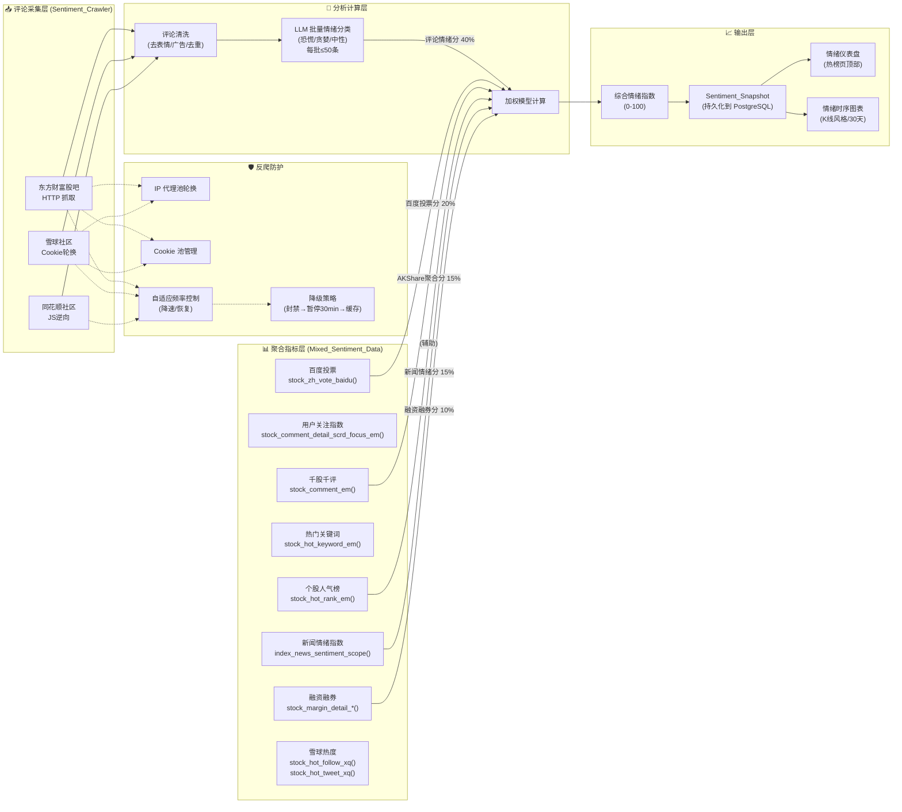
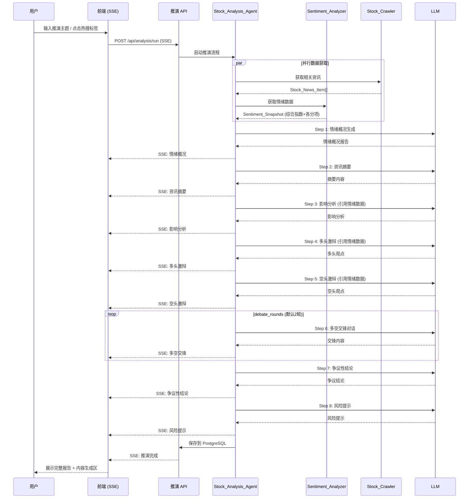
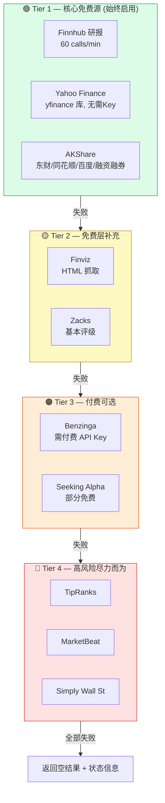
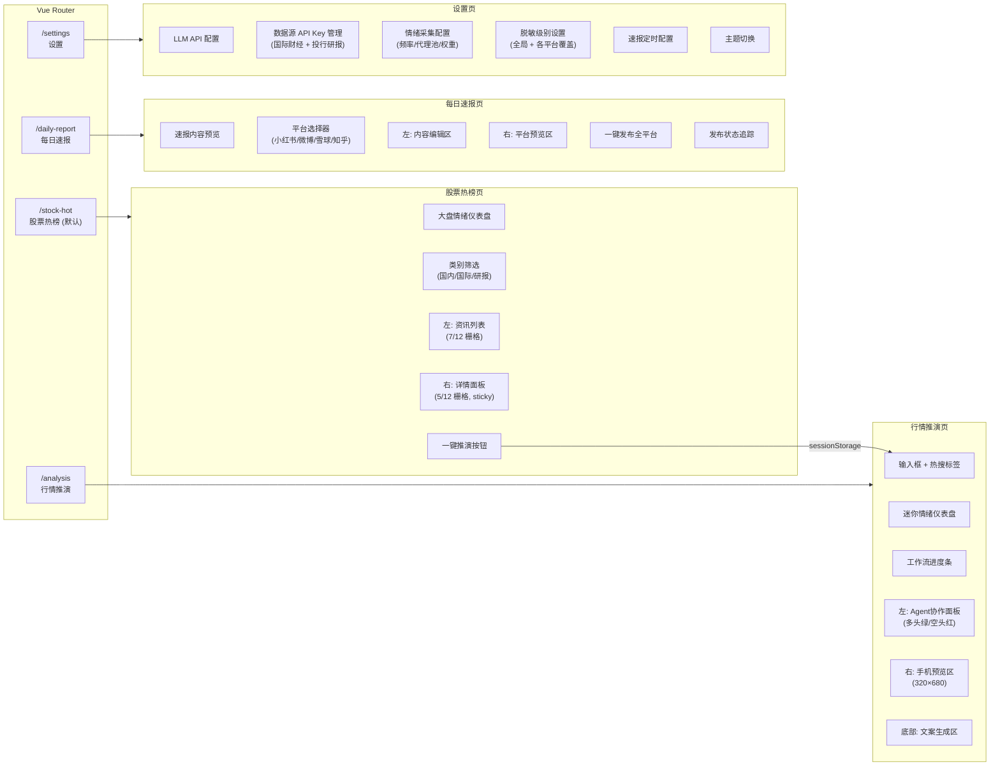
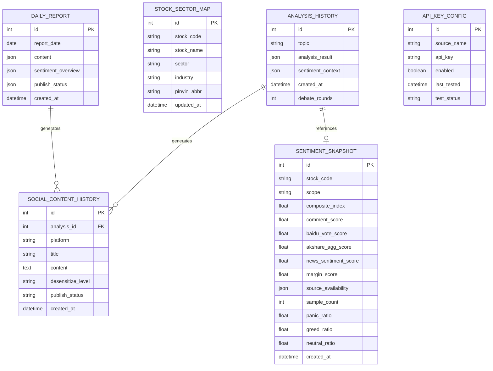

# 股票资讯与行情推演平台 — 系统架构图

## 1. 系统全景架构

```mermaid
graph TB
    subgraph 用户层["🖥️ 用户层 (Vue 3 + Tailwind CSS)"]
        NAV["导航栏<br/>股票热榜 | 行情推演 | 每日速报 | 设置"]
        SHV["股票热榜页<br/>StockHotView"]
        SAV["行情推演页<br/>StockAnalysisView"]
        DRV["每日速报页<br/>DailyReportView"]
        STV["设置页<br/>SettingsView"]
    end

    subgraph API层["⚡ API 层 (FastAPI)"]
        STOCK_API["股票资讯 API<br/>/api/stock/*"]
        ANALYSIS_API["行情推演 API<br/>/api/analysis/* (SSE)"]
        CONTENT_API["社交内容 API<br/>/api/content/*"]
        SENTIMENT_API["情绪数据 API<br/>/api/sentiment/*"]
        SETTINGS_API["设置 API<br/>/api/settings/*"]
        REPORT_API["每日速报 API<br/>/api/daily-report/*"]
    end

    subgraph 核心服务层["🧠 核心服务层"]
        SC["Stock_Crawler<br/>股票资讯采集服务"]
        SAA["Stock_Analysis_Agent<br/>行情推演 Agent"]
        SCG["Social_Content_Generator<br/>社交内容生成服务"]
        SEN_C["Sentiment_Crawler<br/>散户评论采集服务"]
        SEN_A["Sentiment_Analyzer<br/>情绪分析服务"]
        MSD["Mixed_Sentiment_Data<br/>混合情绪数据聚合"]
        COMP["Compliance_Service<br/>合规脱敏服务"]
        DR["Daily_Report_Service<br/>每日速报服务"]
        SCHED["Scheduler_Service<br/>定时调度服务"]
    end

    subgraph LLM层["🤖 LLM 层"]
        LLM["LLM 调用网关<br/>(OpenAI 兼容接口)"]
    end

    subgraph 数据层["💾 数据层"]
        PG["PostgreSQL<br/>(推演历史/内容历史/<br/>情绪快照/板块映射)"]
        CACHE["本地缓存<br/>(资讯30min/推演60min)"]
        SETTINGS_STORE["用户设置存储"]
    end

    subgraph 外部数据源["🌐 外部数据源"]
        direction TB
        subgraph 国内资讯源
            AK["AKShare<br/>(东方财富/同花顺)"]
            SINA["新浪财经 API"]
            XQ_NEWS["雪球热帖"]
            TS["Tushare"]
        end
        subgraph 国际财经源
            FH["Finnhub"]
            NAPI["NewsAPI"]
            AV["Alpha Vantage"]
            GDELT["GDELT Project"]
            GNEWS["Google News RSS"]
            MKT["Marketaux"]
        end
        subgraph 投行研报源
            FH_R["Finnhub 研报"]
            YF["Yahoo Finance"]
            FV["Finviz"]
            ZK["Zacks"]
            BZ["Benzinga (付费)"]
            SA["Seeking Alpha"]
            TR["TipRanks (高风险)"]
        end
        subgraph 情绪数据源
            EF_GUBA["东方财富股吧"]
            XQ_COM["雪球社区评论"]
            THS_COM["同花顺社区"]
            BD_VOTE["百度股市通投票"]
            AK_AGG["AKShare 聚合指标"]
            NEWS_SENT["数库新闻情绪指数"]
            MARGIN["融资融券数据"]
            XQ_HOT["雪球热度数据"]
        end
    end

    subgraph 发布渠道["📱 发布渠道"]
        XHS_MCP["小红书 (XHS MCP)<br/>全自动发布"]
        WB["微博<br/>一键复制"]
        XQ_PUB["雪球<br/>一键复制"]
        ZH["知乎<br/>一键复制"]
    end

    %% 用户层 → API层
    SHV --> STOCK_API
    SHV --> SENTIMENT_API
    SAV --> ANALYSIS_API
    SAV --> CONTENT_API
    SAV --> SENTIMENT_API
    DRV --> REPORT_API
    DRV --> CONTENT_API
    STV --> SETTINGS_API

    %% API层 → 服务层
    STOCK_API --> SC
    ANALYSIS_API --> SAA
    CONTENT_API --> SCG
    SENTIMENT_API --> SEN_A
    SENTIMENT_API --> MSD
    REPORT_API --> DR
    SETTINGS_API --> SETTINGS_STORE

    %% 服务层内部依赖
    SAA --> SEN_A
    SAA --> SC
    SAA --> LLM
    SCG --> COMP
    SCG --> LLM
    SEN_A --> LLM
    SEN_C --> SEN_A
    MSD --> SEN_A
    DR --> SC
    DR --> SEN_A
    DR --> SCG
    SCHED --> SEN_C
    SCHED --> MSD
    SCHED --> DR

    %% 服务层 → 数据源
    SC --> AK
    SC --> SINA
    SC --> XQ_NEWS
    SC --> TS
    SC --> FH
    SC --> NAPI
    SC --> AV
    SC --> GDELT
    SC --> GNEWS
    SC --> MKT
    SC --> FH_R
    SC --> YF
    SC --> FV
    SC --> ZK

    SEN_C --> EF_GUBA
    SEN_C --> XQ_COM
    SEN_C --> THS_COM
    MSD --> BD_VOTE
    MSD --> AK_AGG
    MSD --> NEWS_SENT
    MSD --> MARGIN
    MSD --> XQ_HOT

    %% 服务层 → 数据层
    SAA --> PG
    SCG --> PG
    SEN_A --> PG
    SC --> CACHE
    SAA --> CACHE

    %% 内容发布
    SCG --> XHS_MCP
    SCG --> WB
    SCG --> XQ_PUB
    SCG --> ZH

    %% 样式
    classDef userLayer fill:#e0f2fe,stroke:#0284c7,stroke-width:2px
    classDef apiLayer fill:#fef3c7,stroke:#d97706,stroke-width:2px
    classDef serviceLayer fill:#f0fdf4,stroke:#16a34a,stroke-width:2px
    classDef dataLayer fill:#faf5ff,stroke:#9333ea,stroke-width:2px
    classDef externalLayer fill:#fff1f2,stroke:#e11d48,stroke-width:2px
    classDef publishLayer fill:#ecfdf5,stroke:#059669,stroke-width:2px

    class NAV,SHV,SAV,DRV,STV userLayer
    class STOCK_API,ANALYSIS_API,CONTENT_API,SENTIMENT_API,SETTINGS_API,REPORT_API apiLayer
    class SC,SAA,SCG,SEN_C,SEN_A,MSD,COMP,DR,SCHED serviceLayer
    class PG,CACHE,SETTINGS_STORE dataLayer
    class XHS_MCP,WB,XQ_PUB,ZH publishLayer
```

## 2. 情绪分析引擎架构（核心引擎 — 需求 9 详解）

### 加权模型说明

| 数据源 | 权重 | 数据来源 | 采集方式 | 风险等级 |
|--------|------|----------|----------|----------|
| 评论情绪分 | 40% | 东财股吧/雪球/同花顺 | HTTP爬虫 + LLM分析 | 高（反爬） |
| 百度投票分 | 20% | 百度股市通 | AKShare API | 低 |
| AKShare聚合分 | 15% | 千股千评/人气榜 | AKShare API | 低 |
| 新闻情绪分 | 15% | 数库新闻情绪指数 | AKShare API | 低 |
| 融资融券分 | 10% | 沪深交易所 | AKShare API | 低 |

> 当某数据源不可用时，其权重按比例重分配给其他可用源。若所有评论爬虫均封禁，40% 权重分配给剩余 AKShare 源。

## 3. 行情推演 Agent 工作流

## 4. 社交内容生成与发布流程

```mermaid
graph TB
    subgraph 输入["📥 输入"]
        AR["行情推演结果<br/>Stock_Analysis_Result"]
        SD["情绪数据<br/>Sentiment_Snapshot"]
    end

    subgraph 内容生成["✍️ 内容生成 (LLM)"]
        XHS_G["小红书格式<br/>争议性标题 + 情绪数据亮点<br/>+ 互动引导"]
        WB_G["微博格式<br/>≤140字 + 情绪指数<br/>+ 反问句"]
        XQ_G["雪球格式<br/>深度长文 + 完整交锋<br/>+ 各分项数据"]
        ZH_G["知乎格式<br/>问答体 + 逻辑推理<br/>+ 数据引用"]
    end

    subgraph 合规处理["🔒 合规脱敏 (Compliance_Service)"]
        DM["脱敏处理<br/>轻度(拼音) / 中度(行业) / 重度(板块) / 不脱敏"]
        CODE_RM["股票代码移除/替换"]
        DISC["强制免责声明"]
        MAP["个股→板块映射表<br/>(AKShare 自动构建)"]
    end

    subgraph 预览编辑["👁️ 预览与编辑"]
        XHS_P["小红书预览<br/>手机模拟器"]
        WB_P["微博预览<br/>手机模拟器"]
        XQ_P["雪球预览<br/>桌面卡片"]
        ZH_P["知乎预览<br/>桌面卡片"]
        EDIT["内容编辑<br/>(各平台独立副本)"]
    end

    subgraph 发布["📤 发布"]
        XHS_PUB["小红书发布<br/>XHS MCP 全自动"]
        WB_PUB["微博<br/>一键复制 → 手动粘贴"]
        XQ_PUB["雪球<br/>一键复制 → 手动粘贴"]
        ZH_PUB["知乎<br/>一键复制 → 手动粘贴"]
        IMG["AI 配图生成<br/>(火山引擎文生图)"]
    end

    AR --> XHS_G & WB_G & XQ_G & ZH_G
    SD --> XHS_G & WB_G & XQ_G & ZH_G

    XHS_G --> DM
    WB_G --> DM
    XQ_G --> DM
    ZH_G --> DM
    DM --> CODE_RM --> DISC
    MAP -.-> DM

    DISC --> XHS_P & WB_P & XQ_P & ZH_P
    XHS_P & WB_P & XQ_P & ZH_P --> EDIT

    EDIT --> XHS_PUB
    EDIT --> WB_PUB
    EDIT --> XQ_PUB
    EDIT --> ZH_PUB
    XHS_G --> IMG --> XHS_P
```

## 5. 数据采集分层与降级策略

## 6. 前端页面结构与路由

## 7. 数据库 ER 关系 (PostgreSQL)

## 8. 定时任务调度

| 任务 | 频率 | 说明 |
|------|------|------|
| 情绪数据采集 | 每 2 小时 | 评论爬虫 + AKShare 聚合指标 → 生成 Sentiment_Snapshot |
| 每日速报生成 | 每日 18:00 | 汇总当日热点 + 情绪概况 → 生成速报内容 |
| 增量新闻检查 | 每小时 | 检测重大新闻变化 → 触发速报更新 |
| 历史数据清理 | 每日 03:00 | 清理 >90 天的原始评论数据，保留聚合快照 |
| 板块映射更新 | 每周一 | 通过 AKShare 更新个股→板块映射表 |

## 9. 关键设计决策摘要

| 决策点 | 选择 | 理由 |
|--------|------|------|
| 情绪数据架构 | 混合数据源 (爬虫+API) | 单一爬虫风险高，AKShare 聚合指标作为稳定基座 |
| 发布策略 | 小红书全自动 + 其他平台复制 | 全自动维护成本高，初期聚焦一个平台 |
| 推演流式输出 | SSE (Server-Sent Events) | 单向流式，比 WebSocket 简单，适合 LLM 输出场景 |
| 数据库 | PostgreSQL + SQLAlchemy | 结构化数据多，需要复杂查询和事务支持 |
| 缓存策略 | 资讯 30min / 推演 60min | 平衡实时性和 API 调用成本 |
| 脱敏方案 | 四级可配置 | 不同平台合规要求不同，给用户灵活度 |
| 研报采集 | 四层降级 | 免费源优先，付费/高风险源可选，确保基本可用 |
| UI 复用 | 最大化复用现有组件 | 降低开发成本，保持用户体验一致性 |
